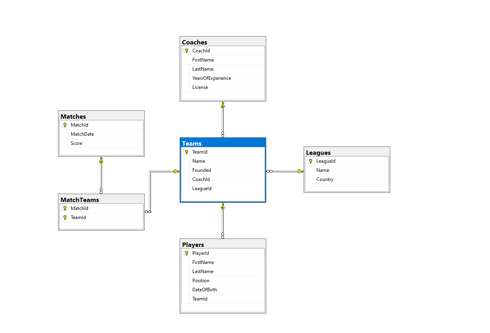
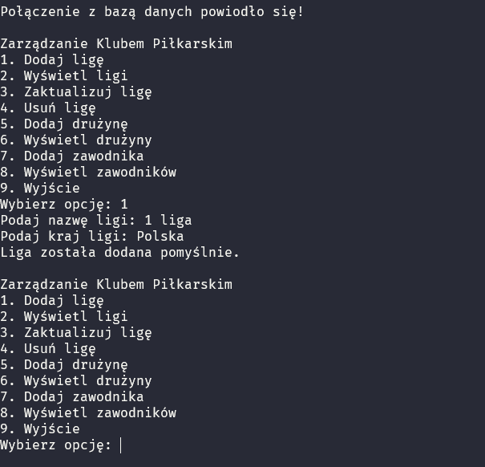
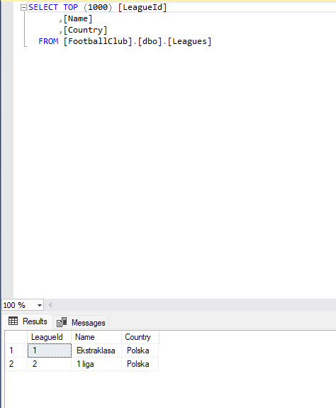

# Dokumentacja projektu FootballClubApp

## Spis treści

1. [Opis projektu](#opis-projektu)
2. [Struktura projektu](#struktura-projektu)
3. [Baza danych](#baza-danych)
   - [Diagram relacji](#diagram-relacji)
4. [Uruchamianie aplikacji](#uruchamianie-aplikacji)
5. [Przykłady użycia](#przyklady-uzycia)
6. [Funkcje aplikacji](#funkcje-aplikacji)

---

## Opis projektu

FootballClubApp to aplikacja konsolowa umożliwiająca zarządzanie danymi o klubach piłkarskich. Projekt wykorzystuje **Entity Framework Core** do interakcji z bazą danych SQL Server. Użytkownicy mogą dodawać, aktualizować, usuwać i przeglądać dane o ligach, drużynach, trenerach, zawodnikach i meczach.

---

## Struktura projektu

Projekt składa się z następujących plików i klas:

- **Models**:
  - `League.cs` - informacje o ligach.
  - `Team.cs` - informacje o drużynach.
  - `Player.cs` - informacje o zawodnikach.
  - `Coach.cs` - informacje o trenerach.
  - `Match.cs` - informacje o meczach.
  - `MatchTeam.cs` - tabela łącząca mecze i drużyny (relacja wiele-do-wiele).

- **FootballClubContext.cs** - konfiguracja bazy danych i definicja relacji między tabelami.
- **Program.cs** - główny plik aplikacji, w którym użytkownik może wykonywać operacje CRUD za pomocą menu konsolowego.

---

## Baza danych

Baza danych składa się z tabel:

- `Leagues`
- `Teams`
- `Players`
- `Coaches`
- `Matches`
- `MatchTeams`

### Diagram relacji



---

## Uruchamianie aplikacji

1. Upewnij się, że zainstalowany jest **SQL Server**.
2. Zaktualizuj connection string w pliku `Program.cs` w linii:
   ```csharp
   .UseSqlServer("ConnectionString")
   ```
---

## Przykłady użycia

### Dodanie nowej ligi

1. Wybierz opcję `1` w menu.
2. Wprowadź nazwę ligi i kraj.

Przykład:
```
Podaj nazwę ligi: Premier League
Podaj kraj ligi: Anglia
Liga została dodana pomyślnie.
```

### Wyświetlenie wszystkich drużyn

1. Wybierz opcję `6` w menu.
2. Aplikacja wyświetli listę wszystkich drużyn wraz z nazwą ligi, do której należą.

Przykład:
```
Drużyny:
ID: 1, Nazwa: Manchester United, Liga: Premier League
ID: 2, Nazwa: Liverpool FC, Liga: Premier League
```

---

## Funkcje aplikacji

1. Zarządzanie ligami:
   - Dodawanie
   - Wyświetlanie
   - Aktualizacja
   - Usuwanie

2. Zarządzanie drużynami:
   - Dodawanie
   - Wyświetlanie

3. Obsługa zawodników, trenerów i meczów:
   - Relacje między danymi

---

## Wyniki wykonanych przykładowych działań

Przykład dodania ligi



Wynik w tabeli




